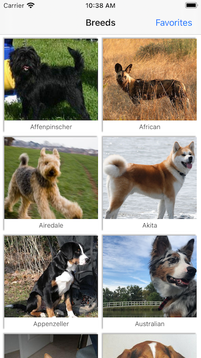
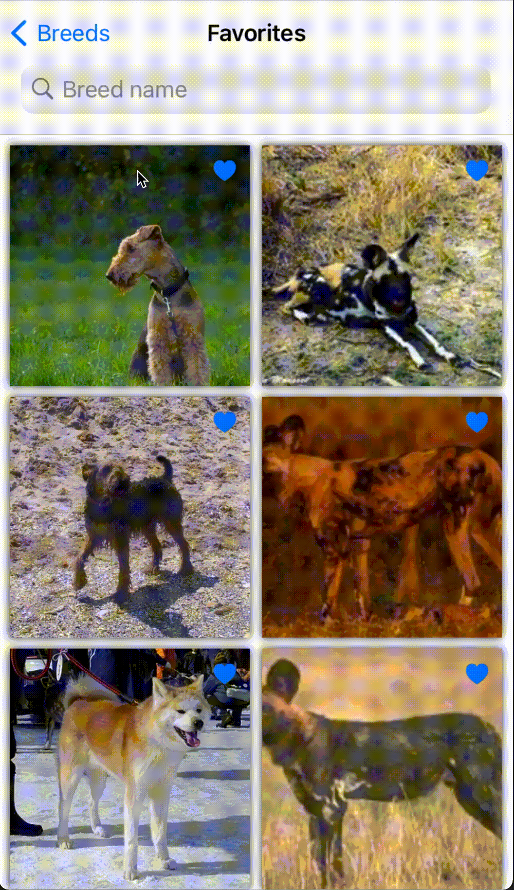

# Dog Breed Catalog
Open source dog images catalog viewer



The app consists of three screens: breed names with random images of each breed, images for a particular breed and favorites. The high level design of the app is based on the Coordinator pattern. There are two important parts: [NavigationRouting](x-source-tag://NavigationRouting) which is responsible for push/pop navigation stack operations and [NavigationCoordinating](x-source-tag://NavigationCoordinating) which encapsulates instantiating and transition between view controllers. So, view controllers itself does not know dependencies and has nothing to do with transitions. There are two main types of the routers: for horizontal flow and vertical flow. The horizontal flow means navigating back and forth in the stack(push/pop) and vertical flow means showing some view controller modally(present). In this app there is no vertical flow thus no vertical router is implemented.

Networking component is organized in a modular way to be able to extend existing functionality and combine different parts  to achieve needed behaviour. The central component of Networking is [NetworkRequest](x-source-tag://NetworkRequest) which defines two parts ```Error``` and ```Response```. The following network request types have been implemented: [DataNetworkRequest](x-source-tag://DataNetworkRequest), [DataRetriableNetworkRequest](x-source-tag://DataRetriableNetworkRequest), [DecodableNetworkRequest](x-source-tag://DecodableNetworkRequest), [ImageCashableNetworkRequest](x-source-tag://ImageCashableNetworkRequest). Error handling is implemented in ```DataNetworkRequest```. Retry mechanism is implemented in ```DataRetriableNetworkRequest```. Each subsequent type is based on the implementation of the previous type. Which means ```DataRetriableNetworkRequest``` has error handling capability from ```DataNetworkRequest```, ```DecodableNetworkRequest``` has error handling and retryable capabilities, the same applies for ```ImageCashableNetworkRequest```. If one class is changed it affects all other parts which in the scope of this small unit may be considered as an advantage. The only two high level components are supposed to be used by the consumer part: ```DecodableNetworkRequest``` and ```ImageCashableNetworkRequest```. Also caching is implemented in ```ImageCashableNetworkRequest```, so mo actual network is sent if the data exists in the memory. The network communication errors are defined in [NetworkCommunicationError](x-source-tag://NetworkCommunicationError). When communicating two groups of errors might happen: ```transportError``` related to the OS transport layer and ```serverSideError``` generated by the backend side. When using ```DataRetriableNetworkRequest``` it also may wait for a connection restoration if error happens because of the connection lost. Therefore the pause between initiating a network request and receiving a response might be longer than ```connectionTimeout```. So, it is preferable to monitor this corner case in the UI and notify the user accordingly. THe connection monitoring is based on open sourced [Reachability](x-source-tag://Reachability).

On top of the networking layer the service that interacts with the Dog API is implemented. This layer defines all endpoints available in Dog API. The Dog API endpoints are represented in the dog service protocol.

To increase the UI responsiveness the caching technique is implemented based on two level cache [ImageCache](x-source-tag://ImageCache). When caching images also image decompression is done to avoid UI stuttering at the places where ```UIImage``` is created out of the data. The caching is done in two levels. The first level caches compressed images, the second one uncompressed. This is highly likely that under memory stress the second bigger cache will be invalidated first. So, there is a chance that a compressed image even in those conditions will be available and there is still no need to send the expensive network request.

Implementation of UI screens is based on ```BreedsViewController``` and ```BreedImagesViewController```. To load a collection view with the data, diffable data sources are used. The app also supports searching on the favorites screen. For searching results suggestions are shown also for a more intuitive UI.

The app also supports string localization, assets constants and logging. The localization implementation is a sample and in a real project services like phraseapp are used. The logging component supports categories and it is possible to set logging levels separately for each category.

The functional Combine framework is widely used in the app to build a bridge between the data model and UI. So, when something is written to the persistence storage the changes are propagated automatically to the UI level.

A wide variety of extensions are used to eliminate boilerplate code like the following:
- [```Then```](x-source-tag://Then) to set properties in place of definition
- [```UsesAutoLayout```](x-source-tag://UsesAutoLayout) to enable auto layout at the definition,
- ```weakAssign```, ```executeOnMain``` to avoid boiler plating when subscribing to publishers

This sample app also contains unit tests for demo purposes. Also to monitor publisher values in unit tests a thirdparty package CombineExpectations is used.
